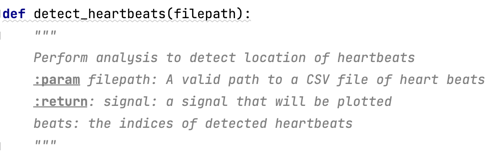
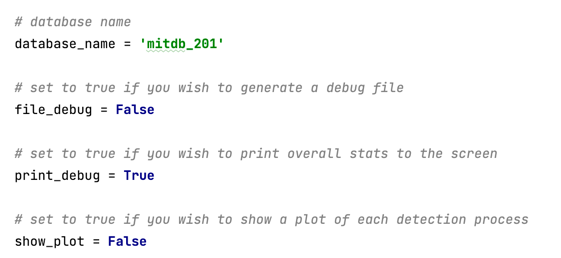

**7.4.1 - Full EKG Detection**

Implement both the processing pipeline (Assignment 7.3.2) and a signal detection process (Assignment 7.3.3 or 7.3.4) approach.

Your solution should be fully implemented within the detect_heartbeats() function in the template. Your code will be passed
a valid path to a file that contains an EKG record. Your detect_heartbeats() should return the resulting processed signal 
(so it can be plotted) and a list of indices that represent the location of heart beats within the dataset.

The instructor has implemented code below `if __name__=='__main__'` that will plot various data sources and produce various outputs that may be helpful.

__database_name__: Should correspond to the name of a EKG record that is located within the data\EKG folder.

__file_debug__: Will produce a textual result of your processed signal that can be used in other programs.

__print_debug__: Will print lots of additional information to the terminal/console.

__show_plot__: Will product a variety of plots showing the processes signal and selected peaks.
